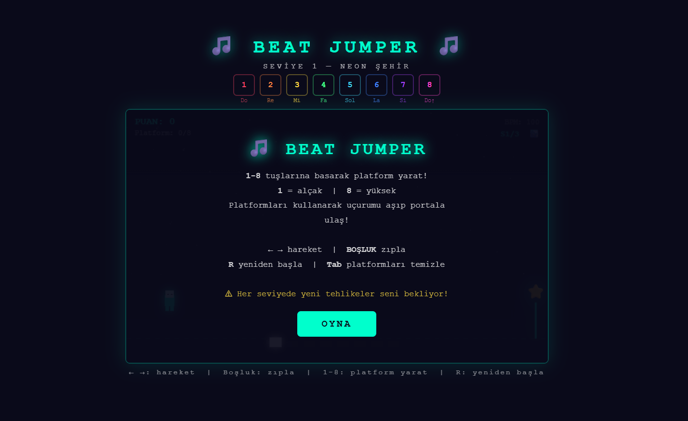
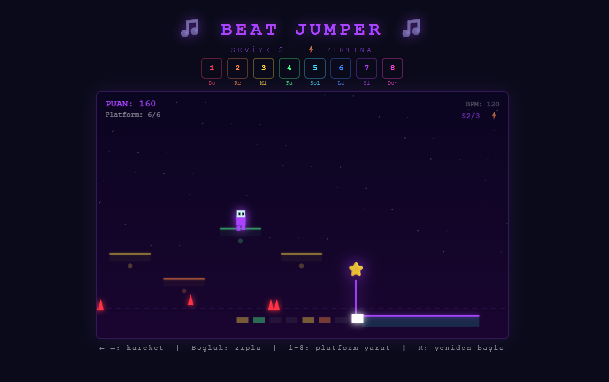
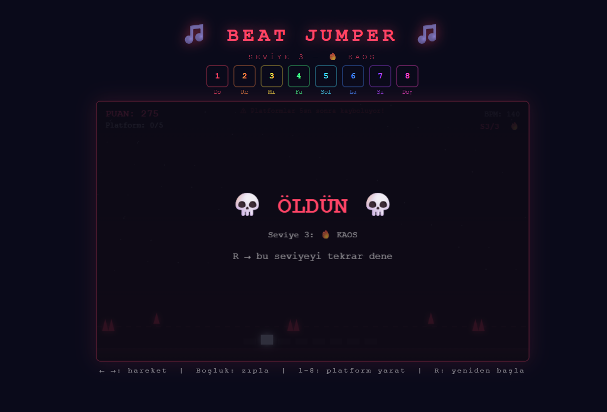

# beaatjumper oyun tanıtımı
Bu proje, Bursa Teknik Üniversitesi Bilgisayar Mühendisliği Bölümü Web Programlama dersi kapsamında geliştirilmiş bir web oyunudur.
SongRunner (https://mattgoode.itch.io/songrunner) adlı oyunun temel mekaniğinden esinlenerek HTML5 Canvas ve javaScript kullanılarak geliştirildi.
Oyunda 3 ses dosyası kullanıldı.
Benim sitemin adresi:https://ezgibigez.github.io/oyun-proje/

# nasıl oynanır
oyun platformları kendin yarattığın bir bölüm-atlama oyunudur. Klavyenin 1-8 numaralı tuşlarına basarak karakterinin önüne farklı yüksekliklerde ve farklı notalarda platformlar oluşturursun. 
Bu platformları kullanarak geniş uçurumları aşman ve her seviyenin sonundaki hedefe ulaşman gerekir.

oyun sayfası açıldığında oyna seçeneğine tıklandığında oyun başlayacaktır.Oyunla birlikte arka plan müziği de çalmaya başlar.
Amaç karakteri bölümün sonuna kadar düşmeden ulaştırmak.Karakteri yön tuşlarıyla sağa sola hareket ettirip boşluk ya da yukarı ok ile zıplatabiliyoruz.
Oyunun asıl olayı kendi yolunu klavyedeki 1-8 tuşlarını kullanarak önüne farklı yüksekliklerde platformlar yerleştirerek boşlukları aşabilmek.
Oyun ilerledikçe hem engeller zorlaşıyor hem de doğru zamanda platform basmak daha önemli hale geliyor.Kısaca hızlı düşünüp doğru tuşlara basarak parkuru tamamlamaya çalışılıyor.

Karakter platformu kaçırıp boşluğa düştüğünde veya bir engele çarptığında ölür.Açılan ekranda karakterin öldüğü ve tekrar başlamak için hangi tuşa basması gerektiği gösterilir.

# nasıl çalıştırılır
Projenin dosyalarını indirip bir klasöre koyduktan sonra index.html dosyasını açarsanız oyun sayfası açılır.

# kaynaklar
oyun içinde kullanılan ses efektleri aşağıdaki kaynaklardan alınmıştır:
1- 8-bit-water-stage-loop.wav (https://freesound.org/)

2- jump.wav(https://freesound.org/)

3- beep.wav(https://freesound.org/)

4- level-complete.wav(https://freesound.org/)

5- game_over.wav(https://freesound.org/)

görsel ve karakter tasarımları projem kapsamında tarafımdan oluşturulmuştur.

